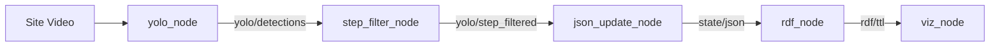

## 1 ROS Deployment Introduction
This ROS2 package implements the semantic-enabled construction progress management pipeline proposed in this study. It integrates YOLOv8-based visual recognition, BIM-guided process filtering, semantic state updating, RDF generation, and progress visualization to identify component installation states and their associated construction processes in real time.

## 2 ROS Project Organization

```text
.
03_ROS
|
├── test_data
|   └── camera_02_sample.mp4
|
├── output_data
|   └── camera_02_sample_results.avi
|
├── models
|   └── view_2.pt
|
├── semantic_base
|   ├── building_graph.ttl
|   ├── building_graph_update.ttl
|   ├── components_state.json
|   └── components_state.ttl
|
└── metadata
|  └── step_view_index.json
|
└── yolov8_detector
    ├── package.xml
    ├── setup.py
    ├── resource/
    |
    └── launch/
    |   └── pipeline.launch.py
    |
    └── yolov8_detector/
        ├── __init__.py
        ├── yolo_node.py
        ├── step_filter_node.py
        ├── json_update_node.py
        ├── rdf_node.py
        └── viz_node.py
```

| Folder | Description |
|--|--|
| test_data | Sample construction video used for ROS inference. |
| output_data | Output videos generated during inference. |
| models | Trained YOLOv8 detection model used for ROS inference. |
| semantic_base | Semantic ontology and RDF files used for progress management. |
| metadata | BIM-based metadata for detection-to-process matching. |
| yolov8_detector | ROS2 package containing all detection, semantic updating, and visualization nodes. |


## 3 ROS Nodes and Workflow
| Node | Function |
|--|--|
| yolo_node | Detects structural components from site video using the trained YOLOv8 model. |
| step_filter_node | Performs process-consistency validation by matching YOLO detections with BIM-based construction process information. |
| json_update_node | Updates component states together with construction process attributes, including start time, finish time, and duration, in JSON format. |
| rdf_node | Writes semantic updates into RDF triples. |
| viz_node | Visualizes component states and construction progress. |

## 4 ROS Topics
| Topic | Publisher | Subscriber | Description |
|--|--|--|--|
| /camera/image_raw | video_publisher | yolo_node | Input construction video stream |
| yolo/detections | yolo_node | step_filter_node | Raw YOLO detection results |
| yolo/step_filtered | step_filter_node | json_update_node | Process-consistent detection results|
| state/json | json_update_node | rdf_node, viz_node | Updated component states and construction process attributes |
| rdf/ttl | rdf_node | viz_node | Updated semantic graph |

## 5 ROS System Flow


## 6 Implementation Note
The logical workflow presented above corresponds to the system architecture described in the paper.

For implementation efficiency and debugging convenience, the final implementation used for the experiments merges the functionalities of the logical *process filtering* and *state updating* modules into a single node (`step_filter_node_video.py`). Consequently, the intermediate topic `yolo/step_filtered` is internally handled within this node rather than being published as an independent ROS topic. This implementation simplification does not alter the overall logical workflow of the proposed framework.

The repository preserves the logical node organization described in the paper for clarity and reproducibility.


## 7 Running the ROS Pipeline

```bash
cd ~/ros2_ws

colcon build --packages-select yolov8_detector --symlink-install

source ~/yolo_infer_env/bin/activate

source /opt/ros/humble/setup.bash

source install/setup.bash

ros2 launch yolov8_detector pipeline.launch.py


