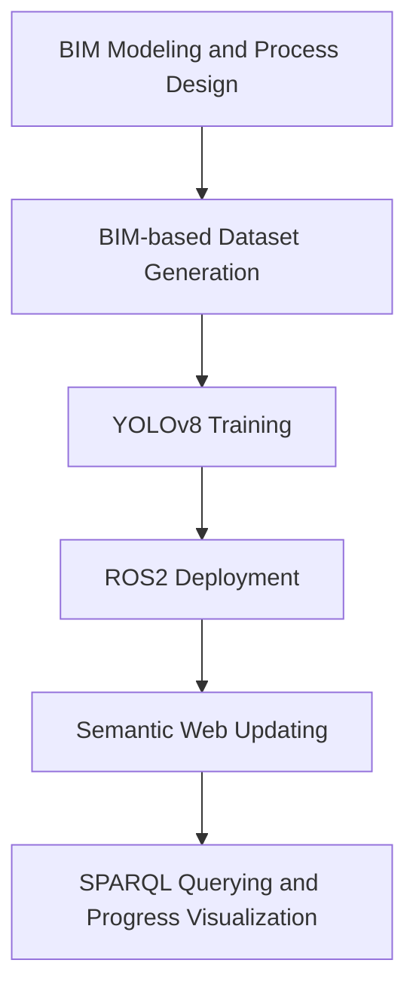

# Semantic-enabled Construction Progress Management Dataset

## 1 Project Introduction
This repository accompanies the paper **"A Vision-driven BIM and Semantic Web Framework for Construction Process  Identification and Progress Management."**  It provides the datasets, trained models, ROS2 deployment scripts, and semantic web resources required to reproduce the proposed vision-driven construction progress management framework. The repository covers the complete workflow from BIM-based dataset generation and visual recognition to semantic updating and SPARQL-based construction progress querying.


The repository supports the following workflow:
- Generate BIM-based construction process datasets;
- Train YOLOv8 models for component installation state recognition and associated construction process identification;
- Integrate visual recognition results into a semantic web for construction progress management.
  
## 2 System Flow



## 3 Repository Structure

```text
.
├── README.md
│
├── 01_BIM
│   ├── SA3.0_attributes.xlsx
│   └── gh_process
│
├── 02_YOLO
│   ├── dataset
│   ├── training_results
│   ├── matching_examples
│   ├── real_site_images
│   └── yolo_train_files
│
├── 03_ROS
│   ├── ros_pipeline.md
│   ├── test_data
│   ├── output_data
│   ├── models 
│   ├── semantic_base
│   ├── metadata
│   └── yolov8_detector
│
└── 04_Semantic_Web
    ├── Cellfie_rules.json
    ├── cpmb.ttl
    ├── progress_before.ttl
    └── progress_after.ttl
```

| Folder | Description |
|--|--|
| 01_BIM | BIM-based component attributes, process definitions and resource data |
| 02_YOLO | Dataset, training results, trained models, and detection-to-process matching examples |
| 03_ROS | ROS2 deployment package, configuration, and workflow documentation |
| 04_Semantic_Web | Ontology files and semantic progress data |

 
## 4 Experimental Environment

### Hardware

- CPU: AMD 3900
- RAM: 32GB
- GPU: NVIDIA RTX 4060Ti 16GB

Software
- Windows 11
- Ubuntu 22.04
- Rhino 8
- Grasshopper
- Python 3.9
- PyTorch
- YOLOv8
- ROS2 Humble
- Protégé
- GraphDB


## 5 Operation Steps

1. Generate BIM-based component and construction process datasets.
2. Train the YOLOv8 detection model.
3. Deploy the recognition framework in ROS2.
4. Update semantic construction progress information.
5. Query construction progress using SPARQL.


## 6 Reproducibility Notes

- The BIM model is generated in Rhino 8.
- Construction process images are automatically generated using Grasshopper scripts.
- YOLOv8 models are trained independently for two camera viewpoints.
- Historical construction videos are replayed following the original construction timeline.
- Semantic updates are implemented using RDFLib and stored as RDF triples.
- To keep the repository lightweight, only the dataset, trained model, and deployment resources corresponding to the best-performing viewpoint (Camera_02) are provided. Camera_01 was used for comparative evaluation only and is therefore not included in this repository.
- The complete repository structure follows the experimental workflow presented in the paper to facilitate result reproduction.


## 7 Contact Information
**Corresponding Author**
Hong Zhang
School of Architecture, Southeast University
Email: HongZhang555@seu.edu.com

**First Author**
Xini Chai
School of Architecture, Southeast University
Email: chaixini@126.com


## 8 Citation
If you use this repository in your research, please cite our paper.
(BibTeX will be updated after publication.)
